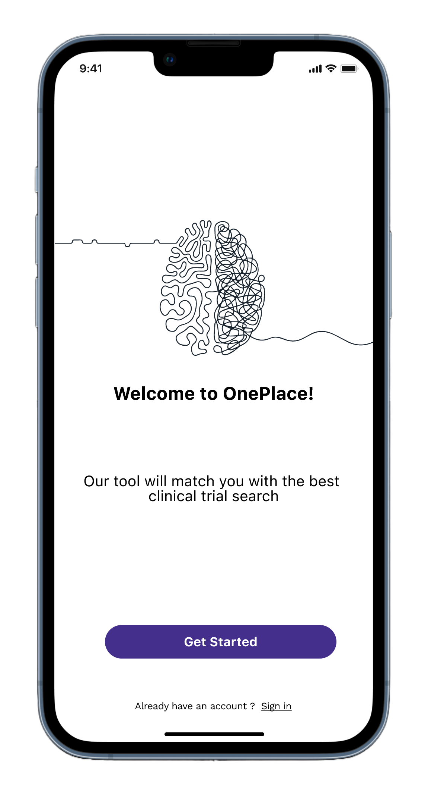
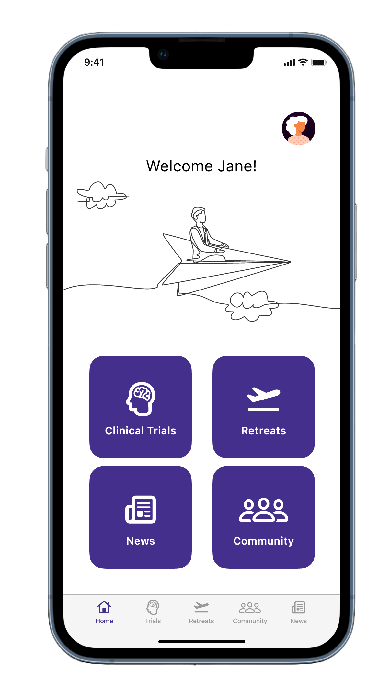
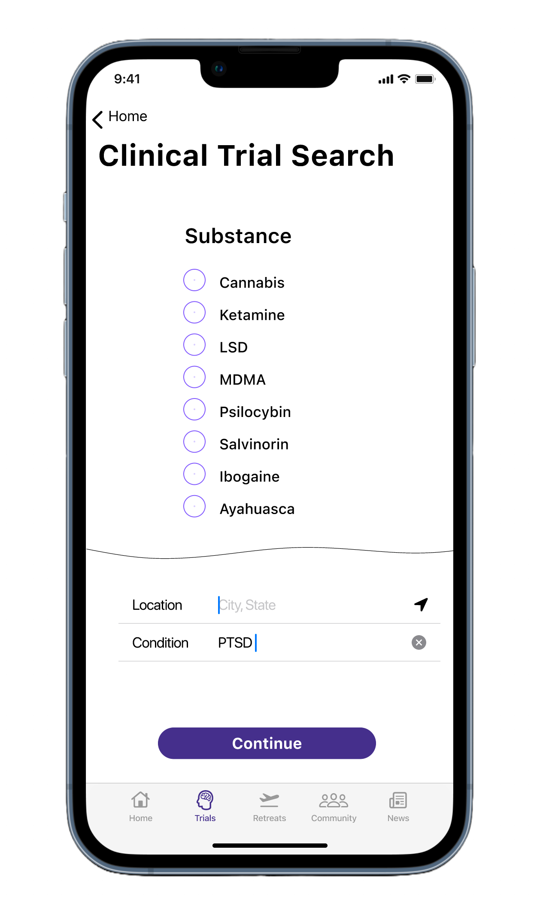
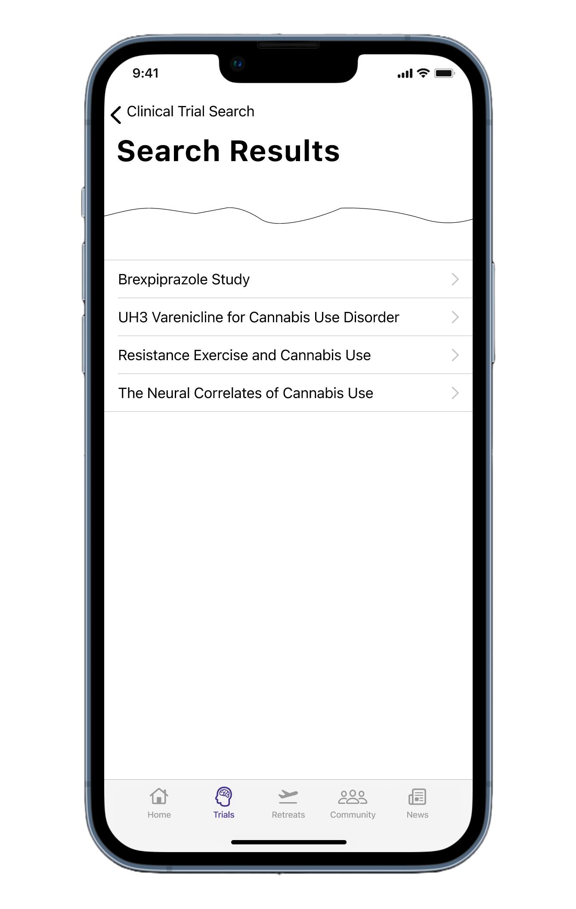
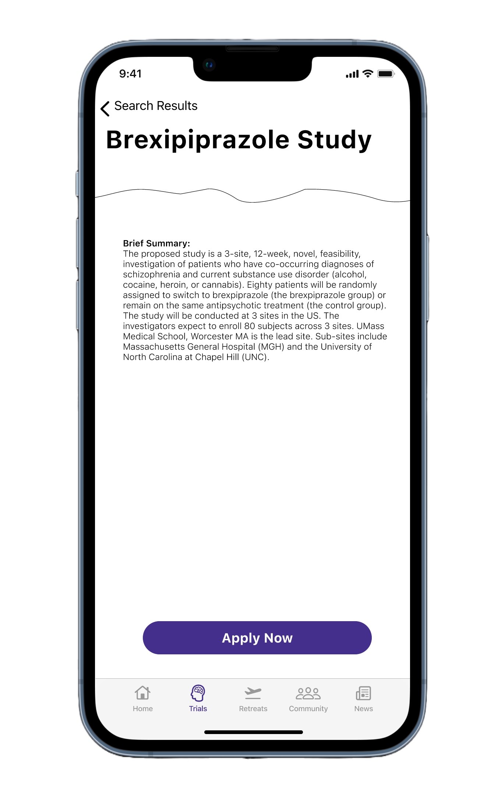

import './oneplace.css';

One Place is a website and app for an upcoming psychedelic mental health treatment community 
for patients and mental health professionals. 

I began working on One Place in the fall of 2021 with preliminary user and industry research. 
This allowed me to understand the burgeoning psychedelic mental health industry from a holistic
perspective, and I crafted multiple user personas for patients and mental health and industry professionals
who will be using the community and its resoources.

<figure>

<figcaption>Fig. 1 - Therapist Flow</figcaption>
</figure>

<figure>

<figcaption>Fig. 2 - Retreat Manager Flow</figcaption>
</figure>

Once the personas were created, I generated some user flow diagrams to outline the processes a user
will be able to perform on the website and mobile app. The two main user types, patients and therapists,
interact with One Place in different ways and both in conjunction with and independently of each other.

<figure>

<figcaption>Fig. 3 - Low Fidelity Wireframes</figcaption>
</figure>

After the low fidelity wireframes were validated with users, I set out to work making the high fidelity prototypes in Figma.

Below are screenshots from the clinical trial search flow.

<figure>

<figcaption>Fig. 4 - High Fidelity Wireframe - Home Screen</figcaption>
</figure>

<figure>

<figcaption>Fig. 5 - High Fidelity Wireframe - Post Login Landing Screen</figcaption>
</figure>

<figure>

<figcaption>Fig. 6 - High Fidelity Wireframe - Clinical Trial Search - Search Form</figcaption>
</figure>

<figure>

<figcaption>Fig. 7 - High Fidelity Wireframe - Clinical Trial Search - Search Results List</figcaption>
</figure>

<figure>

<figcaption>Fig. 8 - High Fidelity Wireframe - Clinical Trial Search - Clinical Trial Detailed Information</figcaption>
</figure>

<figure>

<figcaption>Fig. 9 - High Fidelity Wireframe - Clinical Trial Search - Clinical Trial Contact Info</figcaption>
</figure>

