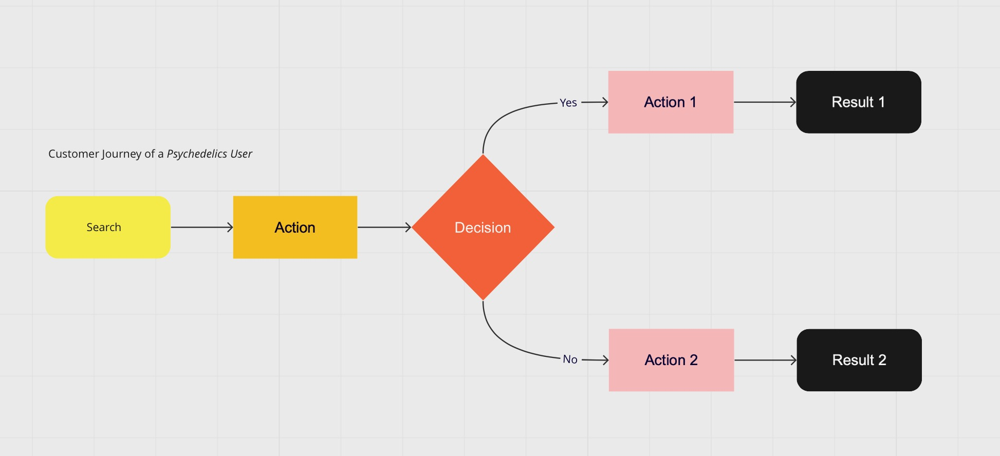
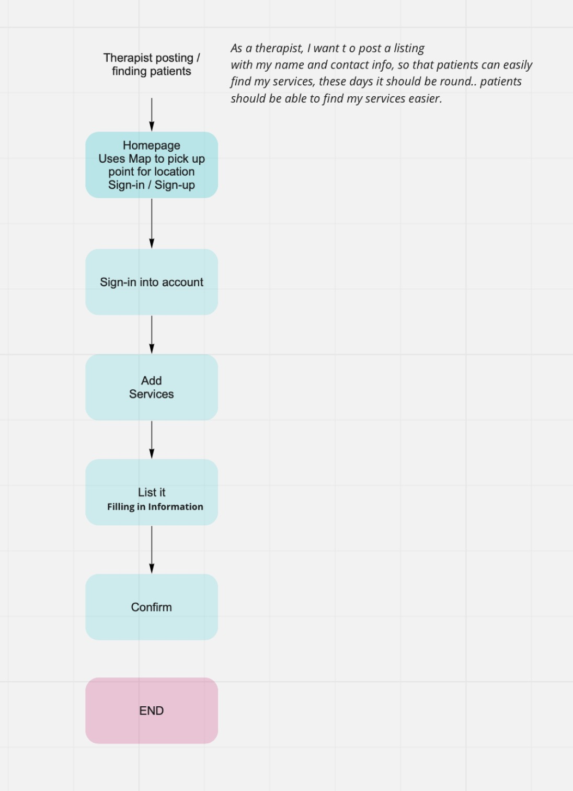
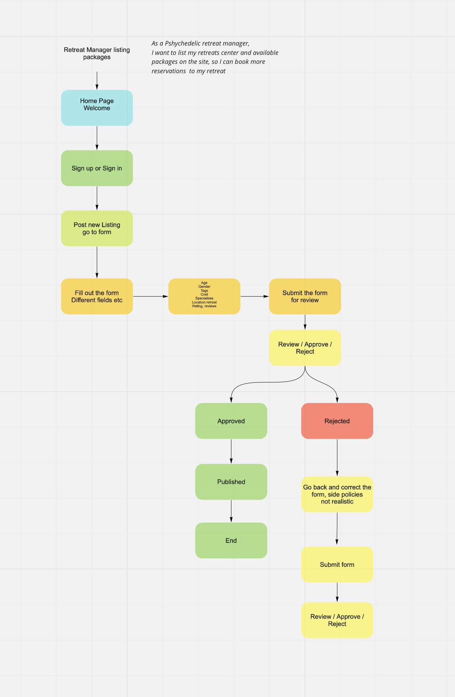
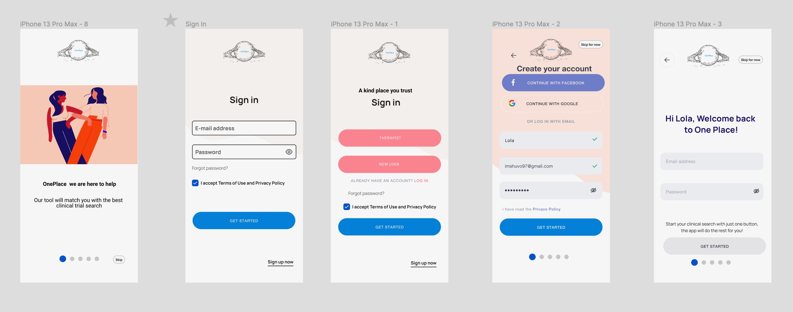
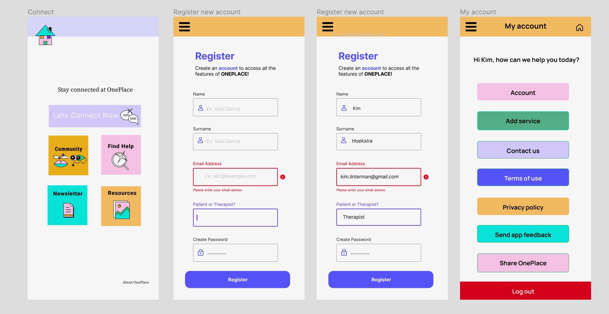

One Place is a website and app for an upcoming psychedelic mental health treatment community 
for patients and mental health professionals. 

I began working on One Place in the fall of 2021 with preliminary user and industry research. 
This allowed me to understand the burgeoning psychedelic mental health industry from a holistic
perspective, and I crafted multiple user personas for patients and mental health and industry professionals
who will be using the community and its resoources.

<figure>

<figcaption>Fig. 1 - Customer Journey Map</figcaption>
</figure>

<figure>

<figcaption>Fig. 2 - Therapist Flow</figcaption>
</figure>

<figure>

<figcaption>Fig. 3 - Retreat Manager Flow</figcaption>
</figure>

Once the personas were created, I generated some user flow diagrams to outline the processes a user
will be able to perform on the website and mobile app. The two main user types, patients and therapists,
interact with One Place in different ways and both in conjunction with and independently of each other.

<figure>

<figcaption>Fig. 4 - Login Flow Wireframes</figcaption>
</figure>

<figure>

<figcaption>Fig. 5 - Mobile Flow Wireframes</figcaption>
</figure>

<figure>

<figcaption>Fig. 6 - Low Fidelity Wireframes</figcaption>
</figure>

