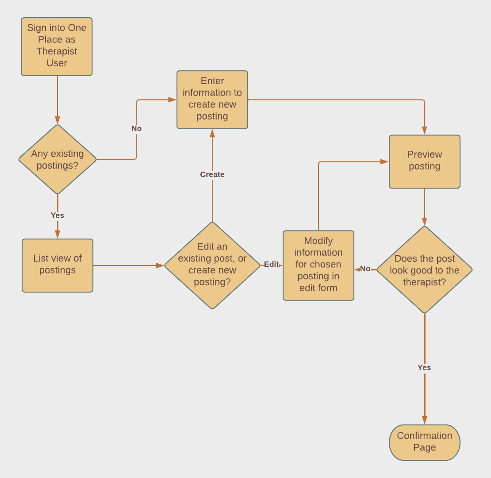
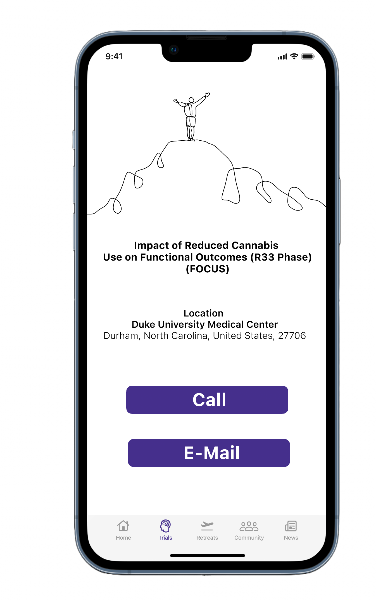

import './oneplace.css';

## What is One Place?

One Place is a website and app for an upcoming psychedelic mental health treatment community 
for patients and mental health professionals. 

### The Challenge

_The challenge is to understand psychedelic mental health care users, discover pain points, and propose a solution to improve patients' clinical search experiences._

### The Goal
Develop a mobile experience to help the users find a psychedelic clinical trial.

## What Problem Did I Solve?

Psychedelics as a class of therapy has shown promise in treating mental health in early research,
especially when paired with the guidance and therapy of mental health professionals. However, it's
very hard to find this kind of therapy at the moment because of the current legal situation 
surrounding psychedelics. Many resources online for psychedelics discuss recreational use, not necessarily
therapy as part of a well-defined mental health treatment program. In addition, current scientific research 
and information on state of the art therapies are not well discussed outside of professional mental health 
settings, making it difficult for the average person to find this information and to seek treatment for 
their conditions. I wanted to make this information easier for people to find, and I wanted them to be able 
to speak with researchers and mental health professionals directly. The easiest way to do that, I thought, was 
to build a community where everyone can gather, in addition to tools that will make it easier to get therapy 
and help, whether through a clinical trial, a therapist program, or even a retreat program.

## The Process

<figure>

<figcaption>Fig. 1 - Wonderland Miami Conference - Open</figcaption>
</figure>

<figure>

<figcaption>Fig. 2 - Wonderland Miami Conference - Opening Panel</figcaption>
</figure>

<figure>

<figcaption>Fig. 3 - Wonderland Miami Conference - Study Results</figcaption>
</figure>

### Preliminary Research

I began working on One Place in the fall of 2021 with preliminary user and industry research. 
My first idea was to make something like the point of sale software used for online ordering at 
medical cannabis dispensaries, thinking that psychedelics would follow a similar path.

I went to an industry conference in late 2021 in Miami, Wonderland, that specialized in psychedelics for mental health.
At the conference I learned about current therapies using psychedelics, industry regulations, legal challenges, and more. After 
listening to multiple conference speakers and talking to other attendees, I realized that my point of sale idea was not the best fit.
I also noticed a gap in how easy it could be to sign up for these psychedelic therapies and clinical trials, so I pivoted my idea to begin
working on clinical trial registration and therapy service signups instead.

<figure>

<figcaption>Fig. 4 - Wonderland Miami Conference - Study Results 2</figcaption>
</figure>

<figure>

<figcaption>Fig. 5 - Wonderland Miami Conference - Study Results 3</figcaption>
</figure>

<figure>

<figcaption>Fig. 6 - Wonderland Miami Conference - Guest Speaker</figcaption>
</figure>

This conference allowed me to understand the burgeoning psychedelic mental health industry from a holistic
perspective, and I crafted multiple user personas for patients and mental health and industry professionals
who will be using the community and its resources.

### Competitive Analysis

There are currently no websites or apps that have the entire feature set of One Place. There are apps and websites 
to find clinical trials, but many of them are generalized frontends to clinicaltrials.gov, the source for US clinical trial data.
Other services that list therapists and offer their services, like ZocDoc, are generic doctor services and don't speclalize in 
mental health nor psychedelic therapy. One Place filters the large lists of clinical trials and therapists/retreats
to those with a mental health and psychedelic focus.

### User Research

I conducted usability testing with 10 users with the goal to find out:
- What needs and goals drive people to find psychedelic mental health treatment?
- What are people struggling with while finding the best mental health treatment”?
- How can we build trust with  psychedelics?
- How can we better connect users with reputable psychedelic treatment?

### The Personas

There are two main user types: Patients and Providers. The Providers are further subdivided into Therapists, 
Clinical Trial Coordinators, and Retreat Managers. Providers list out the types of therapy that they provide 
through various forms on the One Place website, and Patients can search for those therapies available using 
the search tools available to them at One Place.

<figure>

<figcaption>Fig. 7 - Personas - Candy: The Patient</figcaption>
</figure>

### User and Task Flows

Once the personas were created, I generated some user flow diagrams to outline the processes a user
will be able to perform on the website and mobile app. The two main user types, patients and therapists,
interact with One Place in different ways and both in conjunction with and independently of each other.

The following flows were created:
- Patient: Search for Clinical Trial
- Therapist: Create and Manage Service Listing
- Retreat Manager: Create and Manage Retreat Posting

Below are the various therapist flow diagrams:
<figure>

<figcaption>Fig. 8 - Therapist Flow</figcaption>
</figure>

<figure>

<figcaption>Fig. 9 - Retreat Manager Flow</figcaption>
</figure>

### Low Fidelity Wireframes

Once the flows were in place, I began to sketch out some ideas for how these processes would look and work
as mobile app screens. I chose to use pen and paper for these before moving on to Figma for higher fidelity 
wireframes. Below is the final low-fidelity set of sketches for the patient clinical trial search feature.

<figure>

<figcaption>Fig. 10 - Low Fidelity Wireframes</figcaption>
</figure>

### High Fidelity Wireframes

After the low fidelity wireframes were validated with users, I set out to work making the high fidelity prototypes in Figma.

Below are screenshots from the clinical trial search flow.

<figure>

<figcaption>Fig. 11 - High Fidelity Wireframe - Home Screen</figcaption>
</figure>

<figure>

<figcaption>Fig. 12 - High Fidelity Wireframe - Post Login Landing Screen</figcaption>
</figure>

<figure>

<figcaption>Fig. 13 - High Fidelity Wireframe - Clinical Trial Search - Search Form</figcaption>
</figure>

<figure>

<figcaption>Fig. 14 - High Fidelity Wireframe - Clinical Trial Search - Search Results List</figcaption>
</figure>

<figure>

<figcaption>Fig. 15 - High Fidelity Wireframe - Clinical Trial Search - Clinical Trial Detailed Information</figcaption>
</figure>

<figure>

<figcaption>Fig. 16 - High Fidelity Wireframe - Clinical Trial Search - Clinical Trial Contact Info</figcaption>
</figure>

## Lessons Learned

I learned a lot from this project since it was my first professional end to end effort involving user and business research and product design.

I had one idea about the psychedelic therapy industry based on my previous knowledge of the medical cannabis and mental health industries, but
after doing industry research, I saw that psychedelics were going to be very different. The best and safest results with psychedelics are paired with 
a good therapist regiment and other modalities of treatment, and it's important to provide the right information and environments for patients. User
empathy is of the utmost importance, especially when it comes to people's minds, emotions, and lives.

I learned about the entire process of product design from end to end. Not only did I come up with initial research and the artifacts along the way,
I also learned software to perform my job better, like Figma. I learned about UI component libraries for mobile platforms 
and web frameworks and when to use them to save time and increase user familiarity with your application. I learned a lot 
about what it takes to design useful software and I'll take those lessons learned into my future projects, as well as into 
future improvements for One Place.

This UX project has been both overwhelming and intensely rewarding. I have learned a lot on the way and still am, and 
won't stop because I believe that understanding users is an amazing experience, and there is no end to that.